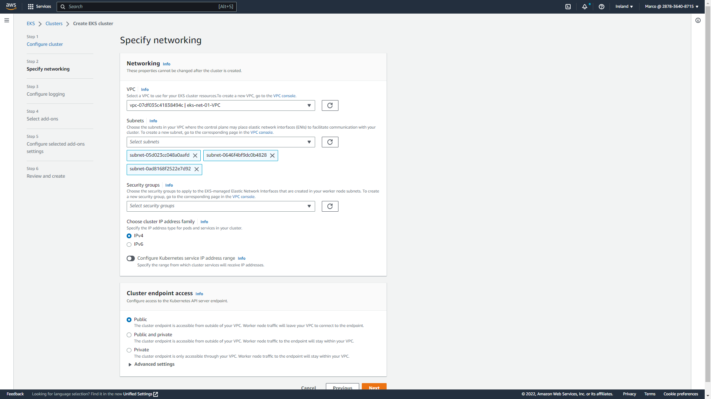

## Prerequisites
- IAM user with admin access
- AWS CLI installed and configured on local machine
- Kubectl installed on local machine
- Helm installed on local machine

## IAM Roles
The first IAM role will be used by the EKS service. Open the IAM console and create a new role using the `EKS - Cluster` use case, which provides the `AmazonEKSClusterPolicy` policy.


In the following example the new role is named `MS-eksClusterRole`.


The second IAM role will be used by the EKS worker nodes. Open the IAM console and create a new role using the `EC2` common use cases, then select the following IAM policy:
- AmazonEC2ContainerRegistryReadOnly
- AmazonEKS_CNI_Policy
- AmazonEKSWorkerNodePolicy


In the following example the new role is named `MS-eksNodeGroup`.


## Networking
In order to create the network will we use a CloudFormation template provided by AWS which will deploy public and private subnets and all the necessary components such as route table, Internet Gateway and NAT Gateway.
The template url is the following
```url
https://s3.us-west-2.amazonaws.com/amazon-eks/cloudformation/2020-10-29/amazon-eks-vpc-private-subnets.yaml
```

Open the CloudFormation console and create a new stack using the above mentioned model.


Name the stack `eks-net-01`. Leave all the other parameters as default and create the stack.


Reference:
https://docs.aws.amazon.com/eks/latest/userguide/creating-a-vpc.html


## EKS cluster deployment
Open the EKS console and create a new cluster named `eks-01` selecting `MS-eksClusterRole` as Cluster service role.


In the networking step select the VPC which were created by CloudFormation, in other words the one with the name starting with `eks-net-01`. Do the same for the Security Group. For `Cluster endpoint access` select `Public and private`. Leave all the other parameters as default and create the cluster.




## Kubectl configuration
In order to create the kubectl configuration file on our local machine run the following command in which we need to specify the region and the EKS cluster name

```sh
aws eks --region eu-west-1 update-kubeconfig --name eks-01
```

You should expect an output like the following:
```sh
$ aws eks --region eu-west-1 update-kubeconfig --name eks-01
Added new context arn:aws:eks:eu-west-1:287836408715:cluster/eks-01 to /home/marco/.kube/config
```

Test the configuration:
```sh
kubectl get svc
```

You should expect an output like the following:
```sh
$ kubectl get svc
NAME         TYPE        CLUSTER-IP   EXTERNAL-IP   PORT(S)   AGE
kubernetes   ClusterIP   10.100.0.1   <none>        443/TCP   11m
```

Reference:
https://aws.amazon.com/premiumsupport/knowledge-center/eks-cluster-connection/

## Create node group
Open the EKS console and create a node group.


Type `node-group-01` in the name field and select `MS-eksNodeGroup` as Node IAM role.


In the Set compute and scaling configuration select t3.medium for the instance type and configure `1 nodes` for Desired/Minimum/Maximum size. 


Leave all the other parameters as default and create the node group.

Check the presence of the worker node in kubernetes running the following command:
```sh
kubectl get nodes
```

You should expect an output like the following:
```sh
$ kubectl get nodes
NAME                                            STATUS   ROLES    AGE     VERSION
ip-192-168-221-254.eu-west-1.compute.internal   Ready    <none>   7m31s   v1.23.9-eks-ba74326
```

## Create a custom namespace and set it as default
Run the following commands in order to create a custom namespace named `marco-namespace` and configure it as the default namespace.
```sh
kubectl create namespace marco-namespace
kubectl config set-context --current --namespace=marco-namespace
```