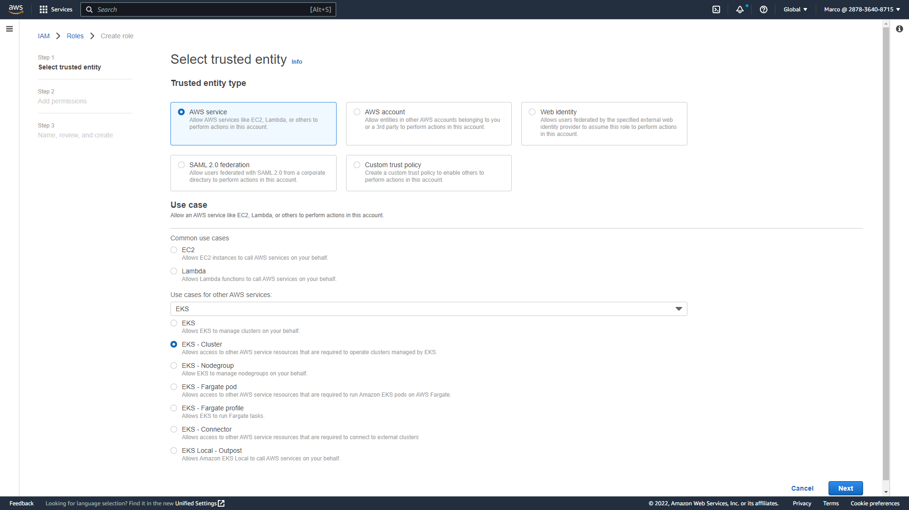

## Prerequisites
- IAM user with admin access
- AWS CLI installed and configured on local machine
- Kubectl installed on local machine
- Helm installed on local machine

## IAM Roles
The first IAM role will be used by the EKS service. Open the IAM console and create a new role using the `EKS - Cluster` use case, which provides the `AmazonEKSClusterPolicy` policy.



In the following example the new role is named `MS-eksClusterRole`.


The second IAM role will be used by the EKS worker nodes. Open the IAM console and create a new role using the `EC2` common use cases, then select the following IAM policy:
- AmazonEC2ContainerRegistryReadOnly
- AmazonEKS_CNI_Policy
- AmazonEKSWorkerNodePolicy


In the following example the new role is named `MS-eksNodeGroup`.


## Networking
In order to create the network will we use a CloudFormation template provided by AWS which will deploy public and private subnets and all the necessary components such as route table, Internet Gateway and NAT Gateway.
The template url is the following
```url
https://s3.us-west-2.amazonaws.com/amazon-eks/cloudformation/2020-10-29/amazon-eks-vpc-private-subnets.yaml
```

Open the CloudFormation console and create a new stack using the above mentioned model.


Name the stack `eks-net-01`. Leave all the other parameters as default and create the stack.


Reference:
https://docs.aws.amazon.com/eks/latest/userguide/creating-a-vpc.html


## EKS cluster deployment
Open the EKS console and create a new cluster named `eks-01` selecting `MS-eksClusterRole` as Cluster service role.


In the networking step select the VPC which were created by CloudFormation, in other words the one with the name starting with `eks-net-01`. Do the same for the Security Group. For `Cluster endpoint access` select `Public and private`. Leave all the other parameters as default and create the cluster.


## Kubectl configuration
In order to create the kubectl configuration file on our local machine run the following command in which we need to specify the region and the EKS cluster name

```sh
aws eks --region eu-west-1 update-kubeconfig --name eks-01
```

You should expect an output like the following:
```sh
$ aws eks --region eu-west-1 update-kubeconfig --name eks-01
Added new context arn:aws:eks:eu-west-1:287836408715:cluster/eks-01 to /home/marco/.kube/config
```

Test the configuration:
```sh
kubectl get svc
```

You should expect an output like the following:
```sh
$ kubectl get svc
NAME         TYPE        CLUSTER-IP   EXTERNAL-IP   PORT(S)   AGE
kubernetes   ClusterIP   10.100.0.1   <none>        443/TCP   11m
```

Reference:
https://aws.amazon.com/premiumsupport/knowledge-center/eks-cluster-connection/

## Create node group
Open the EKS console and create a node group.


Type `node-group-01` in the name field and select `MS-eksNodeGroup` as Node IAM role.


In the Set compute and scaling configuration select t3.medium for the instance type and configure `1 nodes` for Desired/Minimum/Maximum size. 


Leave all the other parameters as default and create the node group.

Check the presence of the worker node in kubernetes running the following command:
```sh
kubectl get nodes
```

You should expect an output like the following:
```sh
$ kubectl get nodes
NAME                                            STATUS   ROLES    AGE     VERSION
ip-192-168-221-254.eu-west-1.compute.internal   Ready    <none>   7m31s   v1.23.9-eks-ba74326
```

## Create a custom namespace and set it as default
Run the following commands in order to create a custom namespace named `marco-namespace` and configure it as the default namespace.
```sh
kubectl create namespace marco-namespace
kubectl config set-context --current --namespace=marco-namespace
```

Check the list of current configured namespaces.
```sh
kubectl get namespaces
```

You should expect an output like the following:
```sh
$ kubectl get namespaces
NAME              STATUS   AGE
default           Active   11h
kube-node-lease   Active   11h
kube-public       Active   11h
kube-system       Active   11h
marco-namespace   Active   10m
```

## Create ECR repository
Open the ECR console and create a private repository named `node-single-page`.


From the local machine obtain the ECR repository credentials.
```sh
aws ecr get-login-password --region eu-west-1 | docker login --username AWS --password-stdin 287836408715.dkr.ecr.eu-west-1.amazonaws.com
```

## Build and push the image to ECR
Open a shell in the folder `node-single-page` then build and push the Docker image to AWS ECR.

Obtain the ECR repository credentials and perform docker login.
```sh
aws ecr get-login-password --region eu-west-1 | docker login --username AWS --password-stdin 287836408715.dkr.ecr.eu-west-1.amazonaws.com
```

Build the image using the ECR repository name
```sh
docker build -t 287836408715.dkr.ecr.eu-west-1.amazonaws.com/node-single-page .
```
s
Push the image to ECR
```sh
docker push 287836408715.dkr.ecr.eu-west-1.amazonaws.com/node-single-page
```

You should now see the repository updated.


## Deploy the resources in kubernetes
Open a shell in the folder `node-single-page/kubernets` then run the following command in order to deploy the pod and service:
```sh
kubectl apply -f node-single-page-lb-ecr.yaml
```

You should expect an output like the following:
```sh
$ kubectl apply -f node-single-page-lb-ecr.yaml
service/node-single-page-service created
deployment.apps/node-single-page-deployment created
```

Check if the pod is up and running:
```sh
$ kubectl get pods
```

You should expect an output like the following:
```sh
$ kubectl get pods
NAME                                           READY   STATUS    RESTARTS   AGE
node-single-page-deployment-746956d7db-f77ml   1/1     Running   0          73s
```

Check the service parameters:
```sh
$ kubectl get services
```

You should expect an output like the following:
```sh
$ kubectl get services
NAME                       TYPE           CLUSTER-IP     EXTERNAL-IP                                                             PORT(S)        AGE
node-single-page-service   LoadBalancer   10.100.27.42   a0baef850d15640e7bff051971b6ce46-67499739.eu-west-1.elb.amazonaws.com   80:32262/TCP   2m13s
```

Copy the EXTERNAL-IP address an open it in a browser using HTTP, you should now see the following page:


Delete the pod
```sh
kubectl delete -f node-single-page-lb-ecr.yaml
```

