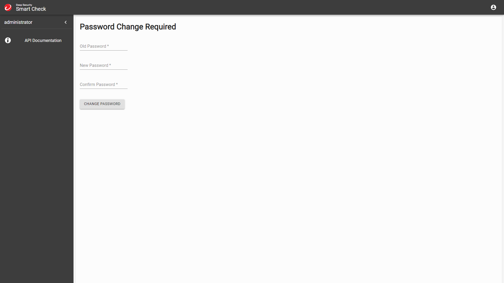

# Trend Micro Cloud One Container Security Lab
## Prerequisites
- IAM user with admin access
- AWS CLI installed and configured on local machine
- Kubectl installed on local machine
- Helm installed on local machine

## IAM Roles
The first IAM role will be used by the EKS service. Open the IAM console and create a new role using the `EKS - Cluster` use case, which provides the `AmazonEKSClusterPolicy` policy.


In the following example the new role is named `MS-eksClusterRole`.


The second IAM role will be used by the EKS worker nodes. Open the IAM console and create a new role using the `EC2` common use cases, then select the following IAM policy:
- AmazonEC2ContainerRegistryReadOnly
- AmazonEKS_CNI_Policy
- AmazonEKSWorkerNodePolicy


In the following example the new role is named `MS-eksNodeGroup`.


## Networking
In order to create the network will we use a CloudFormation template provided by AWS which will deploy public subnets and all the necessary components such as route table and Internet Gateway.
The template url is the following if you would like public subnets only:
```url
https://s3.us-west-2.amazonaws.com/amazon-eks/cloudformation/2020-10-29/amazon-eks-vpc-sample.yaml

```

Alternatively it is also possibile to create a VPC with public and private subnets:
```url
https://s3.us-west-2.amazonaws.com/amazon-eks/cloudformation/2020-10-29/amazon-eks-vpc-private-subnets.yaml
```

Open the CloudFormation console and create a new stack using the above mentioned model.


Name the stack `eks-net-01`. Leave all the other parameters as default and create the stack.


Reference:
https://docs.aws.amazon.com/eks/latest/userguide/creating-a-vpc.html


## EKS cluster deployment
Open the EKS console and create a new cluster named `eks-01` selecting `MS-eksClusterRole` as Cluster service role.


In the networking step select the VPC which were created by CloudFormation, in other words the one with the name starting with `eks-net-01`. For `Cluster endpoint access` select `Public` if you have used the first VPC CloudFormation template or `Public and Private` if you have used the second VPC CloudFormation template. Leave all the other parameters as default and create the cluster.


## Create node group
Open the EKS console and create a node group.


Type `node-group-01` in the name field and select `MS-eksNodeGroup` as Node IAM role.


In the Set compute and scaling configuration select t3.medium for the instance type and configure `1 nodes` for Desired/Minimum/Maximum size. 


Leave all the other parameters as default and create the node group.

Check the presence of the worker node in kubernetes running the following command:
```sh
kubectl get nodes
```

You should expect an output like the following:
```sh
$ kubectl get nodes
NAME                                            STATUS   ROLES    AGE     VERSION
ip-192-168-221-254.eu-west-1.compute.internal   Ready    <none>   7m31s   v1.23.9-eks-ba74326
```

## Kubectl configuration
In order to create the kubectl configuration file on our local machine run the following command in which we need to specify the region and the EKS cluster name

```sh
aws eks --region eu-west-1 update-kubeconfig --name eks-01
```

You should expect an output like the following:
```sh
$ aws eks --region eu-west-1 update-kubeconfig --name eks-01
Added new context arn:aws:eks:eu-west-1:287836408715:cluster/eks-01 to /home/marco/.kube/config
```

Test the configuration:
```sh
kubectl get svc
```

You should expect an output like the following:
```sh
$ kubectl get svc
NAME         TYPE        CLUSTER-IP   EXTERNAL-IP   PORT(S)   AGE
kubernetes   ClusterIP   10.100.0.1   <none>        443/TCP   11m
```

Reference:
https://aws.amazon.com/premiumsupport/knowledge-center/eks-cluster-connection/

## Create a custom namespace and set it as default
Run the following commands in order to create a custom namespace named `marco-namespace` and configure it as the default namespace.
```sh
kubectl create namespace marco-namespace
kubectl config set-context --current --namespace=marco-namespace
```

Check the list of current configured namespaces.
```sh
kubectl get namespaces
```

You should expect an output like the following:
```sh
$ kubectl get namespaces
NAME              STATUS   AGE
default           Active   11h
kube-node-lease   Active   11h
kube-public       Active   11h
kube-system       Active   11h
marco-namespace   Active   10m
```

## Create ECR repository
Open the ECR console and create a private repository named `node-single-page`.


## Build and push the image to ECR
Open a shell in the folder `node-single-page` then build and push the Docker image to AWS ECR.

Obtain the ECR repository credentials and perform docker login.
```sh
aws ecr get-login-password --region eu-west-1 | docker login --username AWS --password-stdin 287836408715.dkr.ecr.eu-west-1.amazonaws.com
```

Build the image using the ECR repository name
```sh
docker build -t 287836408715.dkr.ecr.eu-west-1.amazonaws.com/node-single-page .
```
s
Push the image to ECR
```sh
docker push 287836408715.dkr.ecr.eu-west-1.amazonaws.com/node-single-page
```

You should now see the repository updated.


## Deploy the resources in kubernetes
Open a shell in the folder `node-single-page/kubernets` then run the following command in order to deploy the pod and service:
```sh
kubectl apply -f node-single-page-lb-ecr.yaml
```

You should expect an output like the following:
```sh
$ kubectl apply -f node-single-page-lb-ecr.yaml
service/node-single-page-service created
deployment.apps/node-single-page-deployment created
```

Check if the pod is up and running:
```sh
$ kubectl get pods
```

You should expect an output like the following:
```sh
$ kubectl get pods
NAME                                           READY   STATUS    RESTARTS   AGE
node-single-page-deployment-746956d7db-f77ml   1/1     Running   0          73s
```

Check the service parameters:
```sh
$ kubectl get services
```

You should expect an output like the following:
```sh
$ kubectl get services
NAME                       TYPE           CLUSTER-IP     EXTERNAL-IP                                                             PORT(S)        AGE
node-single-page-service   LoadBalancer   10.100.27.42   a0baef850d15640e7bff051971b6ce46-67499739.eu-west-1.elb.amazonaws.com   80:32262/TCP   2m13s
```

Copy the EXTERNAL-IP address an open it in a browser using HTTP, you should now see the following page:


## Delete the resources in kubernetes
Delete the pod
```sh
kubectl delete -f node-single-page-lb-ecr.yaml
```

## Create RDS PostGres instance

Open the RDS console and create a new DB subnet group. Type `trendmicrodb-subgroup` in the name and description fields. 


Open the RDS console and create a new database with `Standard create`, select `PostgreSQL 13.7-R1` engine and the `Free tier` template.


Type `trendmicrodb` in the DB instance identifier field and choose a username and a password.


Allocate storage up to 20 GiB and disable autoscaling. Then select the same VPC as EKS and add all the public subnets with the Node Group Security Group. Then click Create. Disable Performance Insights. 


Leave all the other options as default and click Create.

## Trend Micro Smart Check
From Trend Micro Cloud One Container Security select Scanners the click on `+ Add a scanner`.
Type a name and click Next.


Save the apiKey somewhere and click Close.


Create a namespace for Smart Check
```sh
kubectl create namespace deepsecurity-smartcheck
```

Create a Config Map importing the RDS certificate.
```sh
kubectl create configmap dssc-db-trust --from-file=ca=rds-combined-ca-bundle.pem -n deepsecurity-smartcheck
```

Edit the overrides-sc.yaml file inserting the RDS credentials and endpoint, and the Trend Micro API Key.

```yaml
# https://github.com/deep-security/smartcheck-helm
db:
  user: <insert_RDS_username_here>
  password: <insert_RDS_password_here>
  host: <insert_RDS_endpoint_here>
  port: 5432
  tls:
    ca:
      valueFrom:
        configMapKeyRef:
          name: dssc-db-trust
          key: ca
cloudOne:
    apiKey: <insert_Trend_Micro_API_Key_here>
    endpoint: https://container.de-1.cloudone.trendmicro.com
auth:
  ## secretSeed is used as part of the password generation process for
  ## all auto-generated internal passwords, ensuring that each installation of
  ## Deep Security Smart Check has different passwords.
  ##
  ## Default value: {must be provided by the installer}
  secretSeed: secretSeed
service:
  type: LoadBalancer
  annotations:
    service.beta.kubernetes.io/aws-load-balancer-type: "nlb"
    service.beta.kubernetes.io/aws-load-balancer-scheme: "internet-facing"
    service.beta.kubernetes.io/aws-load-balancer-nlb-target-type: "ip"
```

Install the Smart Check scanner.
```sh
helm install --namespace deepsecurity-smartcheck --values overrides-sc.yaml deepsecurity-smartcheck https://github.com/deep-security/smartcheck-helm/archive/master.tar.gz
```

You should expect an output like the following:
```sh
$ helm install --namespace deepsecurity-smartcheck --values overrides-sc.yaml deepsecurity-smartcheck https://github.com/deep-security/smartcheck-helm/archive/master.tar.gz
W1202 10:40:14.694926     308 warnings.go:70] batch/v1beta1 CronJob is deprecated in v1.21+, unavailable in v1.25+; use batch/v1 CronJob
W1202 10:40:16.560677     308 warnings.go:70] batch/v1beta1 CronJob is deprecated in v1.21+, unavailable in v1.25+; use batch/v1 CronJob
NAME: deepsecurity-smartcheck
LAST DEPLOYED: Fri Dec  2 10:40:02 2022
NAMESPACE: deepsecurity-smartcheck
STATUS: deployed
REVISION: 1
TEST SUITE: None
NOTES:
It may take a few minutes for the LoadBalancer IP to be available.
You can watch the status of the load balancer by running:

    kubectl get svc --watch --namespace deepsecurity-smartcheck proxy

1. Get the application URL by running these commands:
    Google Cloud or Azure:
    export SERVICE_IP=$(kubectl get svc --namespace deepsecurity-smartcheck proxy -o jsonpath='{.status.loadBalancer.ingress[0].ip}')
    AWS:
    export SERVICE_IP=$(kubectl get svc --namespace deepsecurity-smartcheck proxy -o jsonpath='{.status.loadBalancer.ingress[0].hostname}')
    echo https://$SERVICE_IP:443/

2. Get the initial administrator user name and password by running these commands:

    echo Username: $(kubectl get --namespace deepsecurity-smartcheck secrets -o jsonpath='{ .data.userName }' deepsecurity-smartcheck-auth | base64 --decode)
    echo Password: $(kubectl get --namespace deepsecurity-smartcheck secrets -o jsonpath='{ .data.password }' deepsecurity-smartcheck-auth | base64 --decode)

3. (Optional) Replace the certificate that the service is using. See the
   instructions in the README.md file under "Advanced Topics" > "Replacing the
   service certificate" Use the following values in the kubectl commands:

    Release:   deepsecurity-smartcheck
    Secret:    deepsecurity-smartcheck-tls-certificate
    Namespace: deepsecurity-smartcheck
```

Retrieve Smart Check username
```sh
kubectl get --namespace deepsecurity-smartcheck secrets -o jsonpath='{ .data.userName }' deepsecurity-smartcheck-auth | base64 --decode
```

Retrieve Smart Check temporary password
```sh
kubectl get --namespace deepsecurity-smartcheck secrets -o jsonpath='{ .data.password }' deepsecurity-smartcheck-auth | base64 --decode
```

Check of the pods are up and running
```sh
kubectl get pods -n deepsecurity-smartcheck
```

You should expect an output like the following:
```sh
$ kubectl get pods -n deepsecurity-smartcheck
NAME                                  READY   STATUS    RESTARTS   AGE
auth-697d4fc94d-npcfw                 1/1     Running   0          9m1s
content-scan-65b547f67-btrg2          1/1     Running   0          9m1s
docs-79cbbb49-slv9s                   1/1     Running   0          9m1s
frontend-9b8b47db5-vrwns              1/1     Running   0          9m1s
image-scan-6c9ff6ff45-xzhcq           5/5     Running   0          9m
license-54779d77fb-8wttt              1/1     Running   0          9m1s
malware-scan-df644b44-w2sjl           1/1     Running   0          9m
metrics-76cd9c9b8f-7q87w              1/1     Running   0          9m1s
proxy-5d59b6cc87-gkdfv                1/1     Running   0          9m1s
registryviews-86856b6ff7-2qg25        1/1     Running   0          9m
scan-674dc97bd7-2vmm7                 1/1     Running   0          9m
vulnerability-scan-6dcc96fb85-ftnlh   1/1     Running   0          9m1s
```

Get the AWS ELB fqdn:
```sh
$ kubectl get svc -n deepsecurity-smartcheck
```

You should expect an output like the following:
```sh
$ kubectl get svc -n deepsecurity-smartcheck | grep proxy
proxy                         LoadBalancer   10.100.143.203   af612203d6611484faf144a2cf293107-364720f6281d027c.elb.eu-west-1.amazonaws.com   443:32236/TCP,80:30628/TCP   13m
```

Open the web page and login using the temporary credentials.

On first login it will ask you to change the default password.

#### Add registry
Type a name, select Amazon Elastic Container Registry, select region eu-west-1, select Instance Role, enable both scan option. Leave all the other options as default and click Next.
