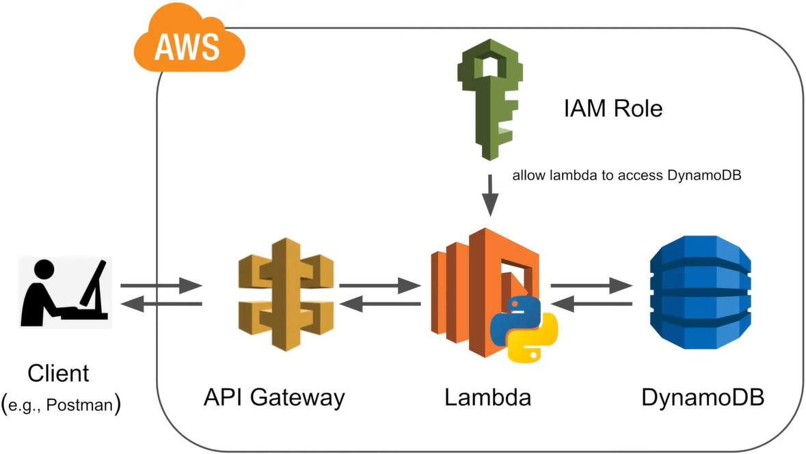
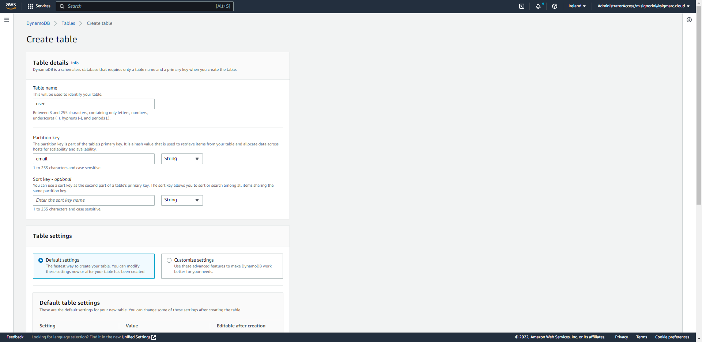
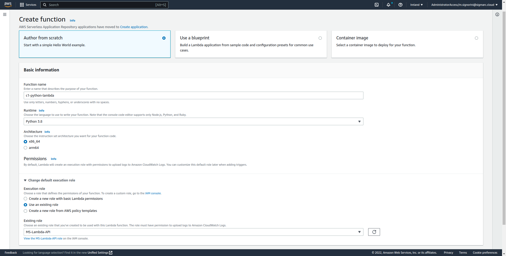
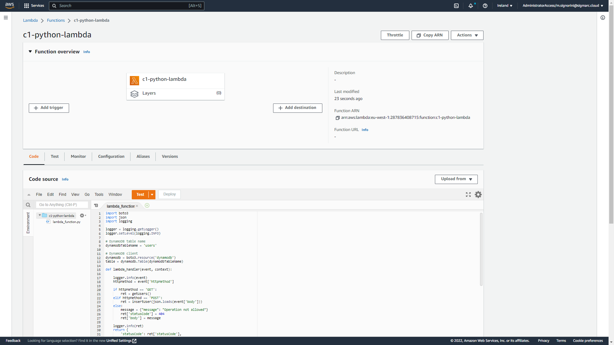
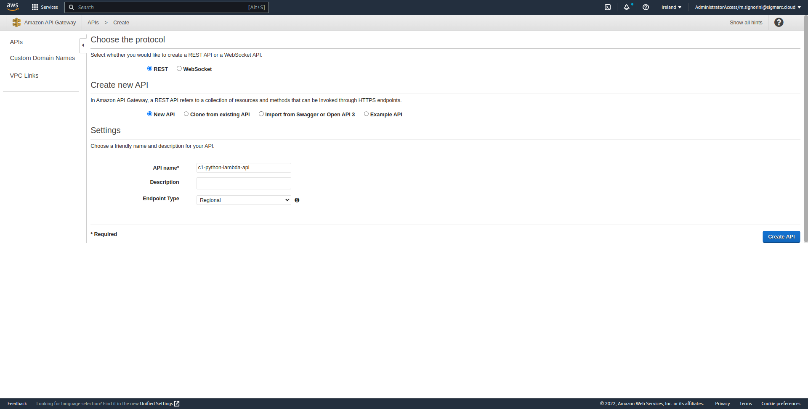
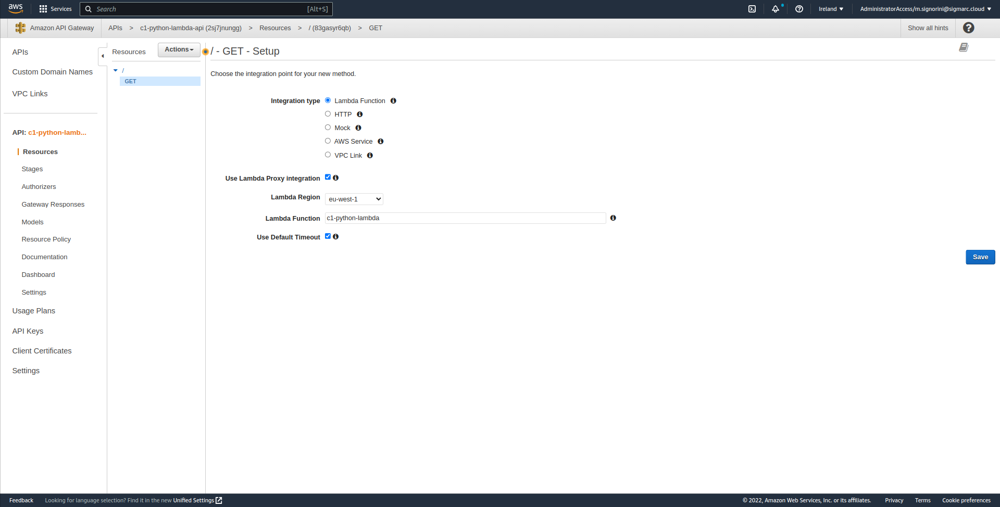
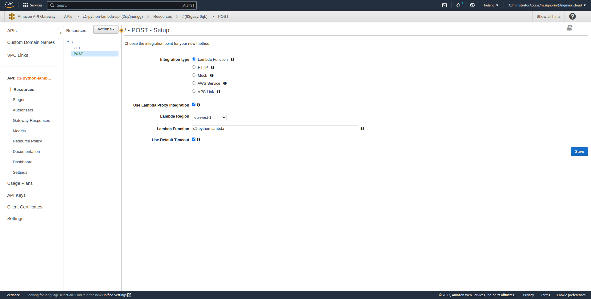
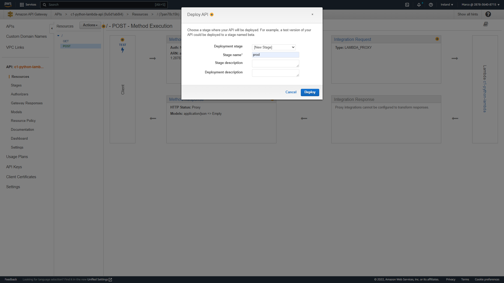

# c1-python-lambda

## Description
This application is a proof of concept for testing `TrendMicro Cloud One Application Security` on a `Python 3.8 Lambda` function running in AWS.

## DynamoDB
Create a new table named `users` with partition key `email` of type String.

## Lambda
Create a new lambda function from scratch named `c1-python-lambda` using runtime `Python 3.8`, architecture `x86_64` and existing role `MS-Lambda-API`.

Copy and paste the source code in the `Code source` editor, then save it and click `Deploy`.

## API Gateway
Create a new API Gateway of type `REST API` then in the next page select protocol `REST` and create `New API`. Use `c1-python-lambda-api` as the API name.

Create Method a GET method selecting `Use Lambda Proxy integration` and lambda function `c1-python-lambda`.

Create Method a POST method selecting `Use Lambda Proxy integration` and lambda function `c1-python-lambda`.

Then deploy API creating a new deployment stage call `prod`.

## TrendMicro
#### Guida
https://cloudone.trendmicro.com/docs/application-security/aws-lambda-with-official-runtimes/#python-layers

#### Python AWS Lambda Layer ARN
arn:aws:lambda:eu-west-1:800880067056:layer:CloudOne-ApplicationSecurity-python:1

#### Connectivity for multi-region aware agents (de)
https://agents.de-1.application.cloudone.trendmicro.com/

#### Environment Variables
'''json
AWS_LAMBDA_EXEC_WRAPPER:	/opt/trend_app_protect
TREND_AP_CACHE_DIR:	/tmp/trend_cache
TREND_AP_HELLO_URL:	https://agents.de-1.application.cloudone.trendmicro.com/
TREND_AP_HTTP_TIMEOUT:	5
TREND_AP_INITIAL_DELAY_MS:	1
TREND_AP_KEY:	ceff8820-97fe-4a8f-9e21-0b58a62d1e8a
TREND_AP_LOG_FILE:	STDERR
TREND_AP_MAX_DELAY_MS:	100
TREND_AP_MIN_REPORT_SIZE:	1
TREND_AP_PREFORK_MODE:	False
TREND_AP_READY_TIMEOUT:	30
TREND_AP_SECRET:	91b6d3ca-375c-4232-970c-9fb0a26aba42
TREND_AP_TRANSACTION_FINISH_TIMEOUT:	10
'''

#### Step
- Add Layer
- - Specify an ARN (arn:aws:lambda:eu-west-1:800880067056:layer:CloudOne-ApplicationSecurity-python:1)
- Configuration / Environment variables

## Postman

#### POST example
Body (RAW/JSON)
{
    "username": "giovanni",
    "email": "giovanni@libero.it"
}